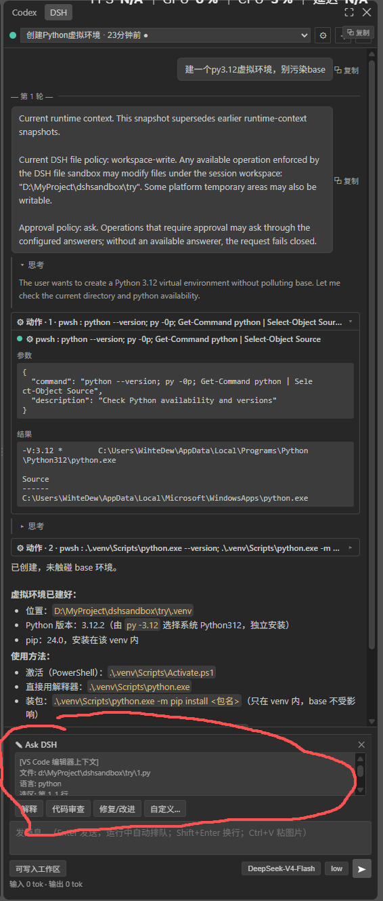
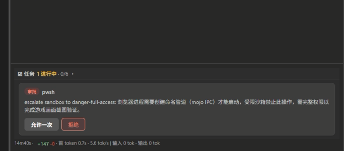
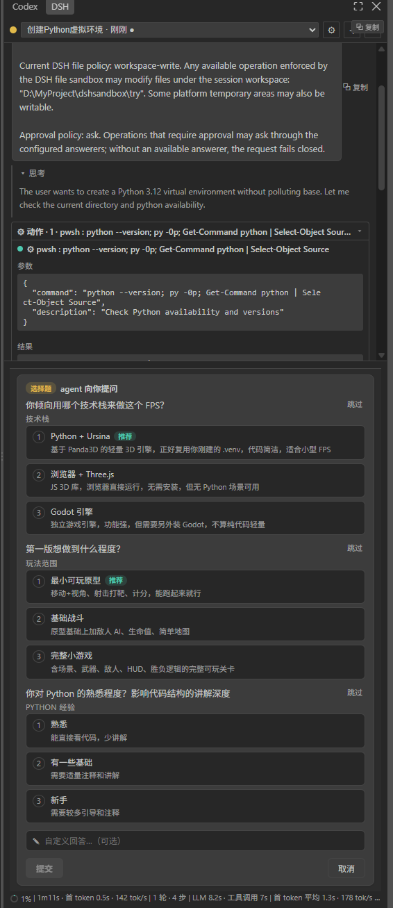
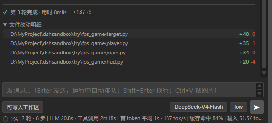
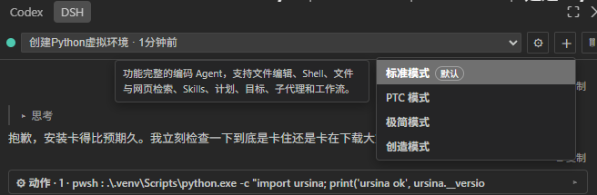

# DSH Bridge · DeepSeek Harness for VS Code

**Run [DeepSeek Harness](https://github.com/deepseek-ai/dsh) — the local AI agent — inside VS Code.** A native sidebar panel plus an editor bridge that connects to DSH as a **protocol client**, without rewriting it and without starting a second server.

Read this in: **English** · [简体中文](README.zh.md)

---


> **TL;DR** — DeepSeek Harness (DSH) is an AI *agent* that lives on your machine (default `http://127.0.0.1:3080`). DSH ships a web UI, but a web UI is just **one client** of DSH's wire protocol. `dsh-vsc` is **another client** — a real VS Code sidebar. It does not rewrite DSH and it does not copy its UI: it talks the protocol and renders the work in a panel that belongs to VS Code, plus a native editor bridge for *your* code.

---

## Table of contents

- [Why dsh-vsc](#why-dsh-vsc)
- [Features](#features)
- [Screenshots](#screenshots)
- [Installation](#installation)
- [Quick start](#quick-start)
- [How it works](#how-it-works)
- [Design philosophy — "pure bridge"](#design-philosophy--pure-bridge)
- [Commands](#commands)
- [Configuration](#configuration)
- [What is deliberately out of scope](#what-is-deliberately-out-of-scope)
- [Development](#development)
- [Documentation](#documentation)
- [Contributing](#contributing)
- [License](#license)

---

## Why dsh-vsc

Most "AI-in-IDE" tools **rebuild the AI**. This project does the opposite:

- **It does not fork or reimplement DeepSeek Harness.** DSH stays byte-identical (`npm` original). Whatever it can do, this extension can surface.
- **It does not embed an iframe of the web UI as the primary experience.** The sidebar is a **native VS Code panel** with a native editor bridge — select code, right-click, ask; watch tool calls, approve operations, review diffs.
- **It stays robust when DSH updates.** It consumes DSH's **wire contract (protocol)**, not its UI. DSH's UI can change freely; this extension does not have to follow.

If you already use DSH (web GUI or CLI) and you work in VS Code, `dsh-vsc` turns your editor into a first-class DSH surface with **one shared history, one contract, and no second server**.

## Features

**Native sidebar panel**
- Streaming agent replies, collapsible **reasoning** and per-turn **timing**.
- Adjacent tool calls merged into **"⚙ Actions"** collapsible blocks; **`+N-M`** change stats per turn.
- **Approval cards** when the agent asks to run a privileged operation — allow once / deny.
- **Question cards** for agent questions: single-choice (number keys), multi-select checkboxes, recommended badge, custom answer with ↑↓ recall, skip — answered via `/api/respond`.
- **Session modes** (standard / PTC / minimal / creative), **reasoning-effort** switch, and **permission-preset** switch (read-only / workspace-write / full-access).
- **Composer takeover**: the input bar hides while the agent is asking, so you can't accidentally send a message mid-question.

**Native editor bridge**
- **Ask DSH about a selection** — select code → right-click → *DSH: Ask about selection*, with a structured context card (file / selection / workspace / branch) into the latest session; explain / review / fix / custom.
- **Review Agent Changes** — watches `write` / `edit` / `str_replace_editor` tool calls, reports changed files per turn, opens the native VS Code **git diff** in one click.

**Harness lifecycle**
- Reuses a running DSH (shared client, no second server); auto-starts one only when none is reachable; self-heals (respawns on death with backoff); reference-counted shutdown (never kills a harness another client is using). Full detail in [How it works](#how-it-works).

## Screenshots

**Sidebar & chat** — the native DSH panel: session list, streaming reply, collapsible "⚙ Actions", per-turn timing, `+N-M` stats

<p align="center"></p>

**Ask about selection** — select code in the editor, right-click → *DSH: Ask about selection*

<p align="center"></p>

**Ask card** — structured context card (file / selection / workspace / branch) shown in the panel

<p align="center"></p>

**Approval card** — allow once / deny when the agent requests a privileged operation

<p align="center"></p>

**Question card** — single / multi choice, recommended badge, custom answer

<p align="center"></p>

**Review Agent Changes** — changed files per turn → native git diff

<p align="center"></p>

**Session modes** — standard / PTC / minimal / creative

<p align="center"></p>

## Installation

> Requires Windows / macOS / Linux + VS Code `^1.90.0`. DSH itself does not need to be installed separately — the extension auto-starts one when none is running.

**Option A — Release package (recommended)**

1. Download the latest `dsh-vsc-<version>.vsix` from [Releases](https://github.com/zhibailu/dsh-vsc/releases).
2. Install it (VS Code `Ctrl+Shift+P` → **Install from VSIX**, or command line):

   ```bash
   code --install-extension dsh-vsc-<version>.vsix --force
   ```

3. Reload the window (`Ctrl+Shift+P` → **Reload Window**), then click the **DSH** icon in the left activity bar.

> Existing harnesses are reused automatically (`npm i -g @deepseek-ai/dsh` or a running `npx @deepseek-ai/dsh web`), default `http://127.0.0.1:3080`, overridable with `DSH_WEB_URL` or the `dshVsc.url` setting.

**Option B — from source**

```bash
git clone https://github.com/zhibailu/dsh-vsc.git
cd dsh-vsc
npm install
npm run package        # esbuild build + vsce package → dsh-vsc-<version>.vsix
code --install-extension dsh-vsc-<version>.vsix --force
```

## Quick start

1. **Reload the window** — required after install.
2. Click the **DSH** icon in the left activity bar to open the sidebar.
3. If no harness is running, the extension silently starts one (no window pops up); if one is running, it reuses it.
4. Send a message and watch the agent work.

**No API key needed in the extension.** Your key stays on the DSH side (configured the first time you run `dsh web`). The extension is a shared client and never touches your key.

## How it works

DSH exposes two things: an **RPC interface** (`POST /api/<method>`) and a **real-time event stream** (`/api/events.mux`). The web GUI is just one consumer of that contract.

`dsh-vsc` is a second consumer:

- **`src/harness/client.ts` — a ~200-line minimal protocol client.** It reimplements the DSH wire contract in Node (≥ 18, global `fetch`), imports **no** DSH internals, and is deliberately thin — it implements the protocol, not the plugin framework.
- **Lossless events.** The panel receives the **raw frames** from the event stream with no re-modeling; rendering is the panel's job. The bridge stays transparent, so it can't drift from DSH's semantics.
- **Protocol-first, UI-agnostic.** DSH's official README notes there is *no protocol version field because client and host ship together* — until an independently released client exists. This extension is exactly such an independently released client, standing on the stable **contract** layer rather than the volatile **UI** layer.
- **The one deliberate exception — `overlay`.** Four capabilities the protocol doesn't expose (`clientCount`, hidden tool consoles) are provided by an **in-memory runtime patch** with three safety rails: it mutates only loaded memory (official files stay byte-identical on disk), it **verifies SHA-256** of the official files and bails entirely on mismatch, and it checks **canary anchors** before patching, degrading gracefully on any failure. It has an explicit retirement path (remove each delta once DSH ships the equivalent field, e.g. `hostInstanceId`).
- **Second client, never a second server.** A real incident showed two DSH processes sharing `~/.dsh` corrupt each other's history (`corrupt session log: seq gap`). So the extension never starts a second server on an existing history: it reuses a live harness, auto-starts one only when none is reachable, and shuts it down by **reference count** (queries `host.describe` for `clientCount` before stopping) so it never kills a harness another client is attached to.

A full, reader-friendly deep-dive — written for someone who doesn't know the domain — lives in [docs/design.md](docs/design.md).

## Design philosophy — "pure bridge"

> **I don't take DSH's job; I'm its best client.**

- **Don't rewrite DSH** → stays byte-identical; its stability is yours, its upgrades don't force you to rewrite.
- **Don't copy DSH's UI framework** → re-implementing a plugin system neither flatters DSH nor helps you.
- **Don't start a second DSH** → two processes sharing one history corrupt each other.
- When you *must* patch (overlay), make it **verifiable and degradable** — verify, guard with canaries, fail safe, retire when upstream catches up.

## Commands

| Command | What it does |
|---|---|
| `DSH: Open Sidebar` | Focus the DSH sidebar |
| `DSH: Start Web Harness` | Start/connect the harness explicitly (clears the "don't respawn" latch) |
| `DSH: Stop Auto-started Harness` | Stop only the instance *this* extension started; never a shared one |
| `DSH: Refresh Connection Status` | Re-probe the harness |
| `DSH: Open Web GUI (advanced)` | Open the full embedded DSH web GUI as a tab |
| `DSH: Ask about selection` | Ask DSH about the selected code (also in the right-click menu) |
| `DSH: Review Agent Changes` | Open a native git diff of the files the agent changed |

## Configuration

| Setting | Default | Description |
|---|---|---|
| `dshVsc.url` | `http://127.0.0.1:3080` | Base URL of the DSH harness. Also honors `DSH_WEB_URL`. |
| `dshVsc.autoStart` | `true` | Auto-start `dsh web` when no harness answers at the configured URL. |

## What is deliberately out of scope

- No rewritten chat UI, no event truncation/whitelisting, no API-key re-entry.
- No second harness — reuse a running one, auto-start only when none exists; auto-started instances survive closing VS Code if other clients are attached.
- Change tracking covers only `write` / `edit` / `str_replace_editor` tool events; files changed via a shell are not counted (git diff review still works manually).
- The `+N-M` counter covers only those file tools; the timer is display-only on the bridge side (latest in-flight round; finalized to history when the task ends).
- Ask DSH sends to the **most recently updated** session (not necessarily the one currently open in the webview).
- Approval/question cards appear only for the **currently selected** session.

## Development

```bash
npm install
npm run typecheck   # tsc --noEmit (both configs)
npm run build       # esbuild → dist/extension.js + dist/media
npm run package     # build + package vsix
```

F5 debug via [`.vscode/launch.json`](.vscode/launch.json) → Extension Development Host.

Automated regression test (jsdom simulates the webview, feeds real event streams to verify panel rendering):

```bash
node scratch/auto-test.mjs <sessionId> <turnNo>
```

## Documentation

- [Design & architecture rationale](docs/design.md) — why the "pure bridge" approach, how it stays robust across DSH upgrades, and how the pieces fit.
- [Source map](src/README.md) — what lives where in `src/`.
- [Screenshots](docs/screenshots/) — image assets used by this README.
- [`llms.txt`](llms.txt) — machine-readable doc index for LLM / AI crawlers.
- [`AGENTS.md`](AGENTS.md) — onboarding guide for AI coding agents working in the repo.
- [Changelog](CHANGELOG.md) — release history.
- For maintainers: [GITHUB-SETUP.md](GITHUB-SETUP.md) — repo metadata & topics to set on GitHub for discoverability.

## Contributing

See [CONTRIBUTING.md](CONTRIBUTING.md). We welcome issues, PRs, and docs improvements — especially anything that clarifies the architecture for newcomers.

## License

MIT © 2026 zhibailu — see [LICENSE](LICENSE).
