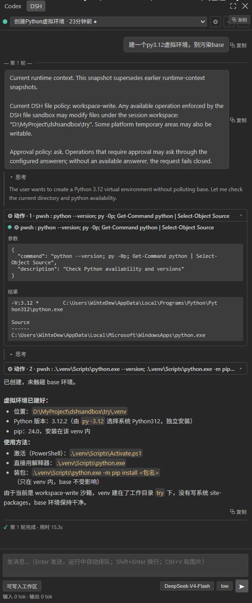
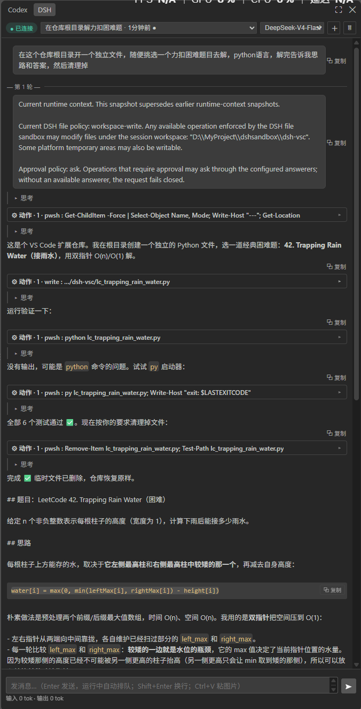
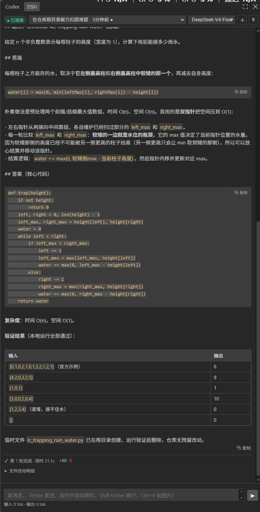
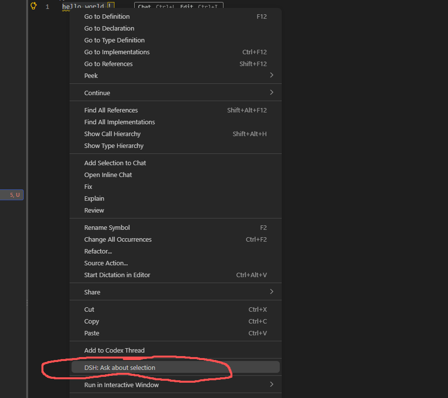

# DSH Bridge (dsh-vsc)

在 VS Code 侧边栏里用 DeepSeek Harness（DSH）干活：嵌入真实 Web GUI + 原生编辑器桥（选区提问、改动审查、文件跳转）。

## 快速开始（最短路径）

需要：Windows / macOS / Linux + Node.js 18+ + VS Code。

```bash
# 1. 安装 dsh（harness 本体）
npm i -g @deepseek-ai/dsh

# 2. 拿源码、装依赖、打包、安装扩展
git clone https://github.com/zhibailu/dsh-vsc.git
cd dsh-vsc
npm install
npm run package
code --install-extension dsh-vsc-0.1.0.vsix --force
```

> 也可以不装全局 dsh：你自己用 `npx @deepseek-ai/dsh web` 跑着 harness，扩展会自动连上它（默认 `http://127.0.0.1:3080`，可用 `DSH_WEB_URL` 或设置 `dshVsc.url` 覆盖）。

## 使用

1. **重载窗口**（Ctrl+Shift+P → Reload Window）——装完必须重载才生效
2. 左侧活动栏点 **DSH** 图标打开侧边栏
3. 没有 harness 在跑时，扩展会自动静默拉起一个（窗口不弹出）；已有则直接复用
4. 发消息，看 agent 干活

**API key 不用在扩展里配**：key 在 dsh 侧配置（第一次 `dsh web` 时按提示设置）。扩展是 harness 的共享客户端，不碰你的 key。

## 截图

**① 侧边栏概览** —— 左侧活动栏 DSH 图标打开原生侧边栏面板



**② 对话与工具动作** —— 流式回复、思考折叠、「⚙ 动作」相邻工具合并块、每轮实时计时（上 / 下两张）

| 上 | 下 |
|---|---|
|  |  |

**③ 编辑器右键 Ask DSH** —— 选中代码后右键 → 菜单底部 "DSH: Ask about selection"



## 功能

- 侧边栏内嵌真实 DSH Web GUI（会话、模型、MCP 工具、热更新与浏览器一致）
- 原生桥：
  - **Ask DSH（选区）**：编辑器选中代码 → 右键 → 解释 / 审查 / 修复 / 自定义，结构化上下文（文件/选区/工作区/分支）送入最新会话
  - **Review Agent Changes**：监控 `write`/`edit`/`str_replace_editor` 工具调用，回合结束提示改动数，一键打开 VS Code 原生 git diff
- 原生侧边栏面板：每轮实时计时、相邻工具动作合并成「⚙ 动作」折叠块、思考（reasoning）折叠、`+N-M` 改动统计

## 边界（诚实版）

- 不重写聊天 UI（嵌入真实前端）；不截断/白名单事件；不要求重输 API key
- 不另起第二个 harness（发现到运行中的就复用，只有没有才自拉；关 VS Code 时若还有其他客户端连着，自拉实例会保留）
- 改动追踪只识别 `write`/`edit`/`str_replace_editor` 工具事件；shell 里改文件不计入（git diff 审查仍可手工用）
- `+N-M` 统计同样只覆盖上述文件工具；`write` 的旧内容为调用瞬间磁盘估算，工具结果自带的 `meta.diffs` 会修正
- 计时器是桥接侧纯展示：只挂最新进行中的一轮，任务结束即固化为历史用时
- Ask DSH 发送到"最近更新的会话"（非空白），不看 webview 当前打开哪个会话

## 开发

```bash
npm install
npm run typecheck   # tsc --noEmit
npm run build       # esbuild → dist/extension.js + dist/media
npm run package     # 打包 vsix
```

F5 调试（`.vscode/launch.json`）→ Extension Development Host。

自动回归测试（jsdom 模拟 webview，喂真实事件流验证面板渲染）：

```bash
node scratch/auto-test.mjs <sessionId> <turnNo>
```

## 许可证

MIT © 2026 zhibailu — 详见 [LICENSE](LICENSE)。
